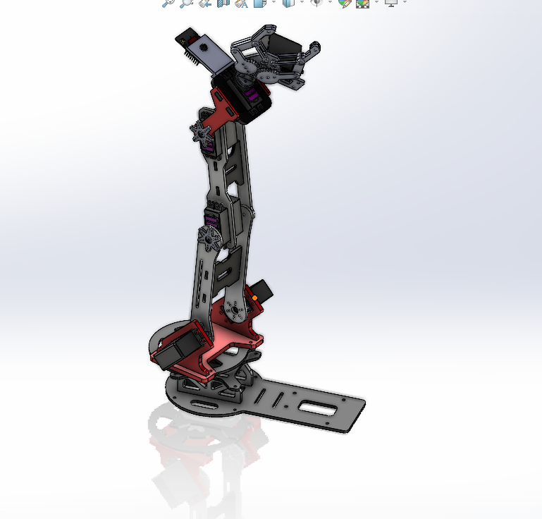
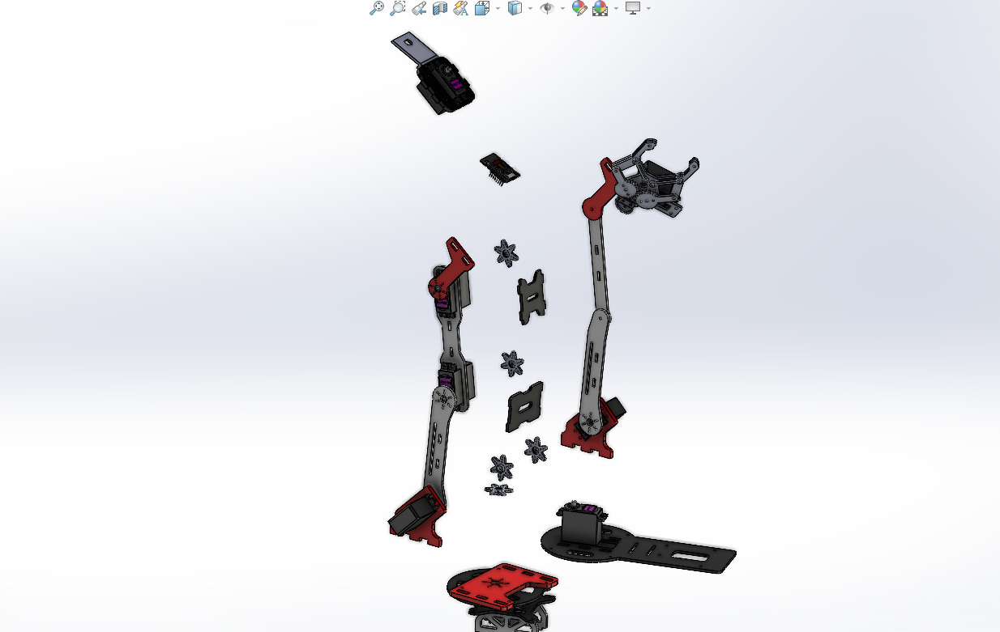
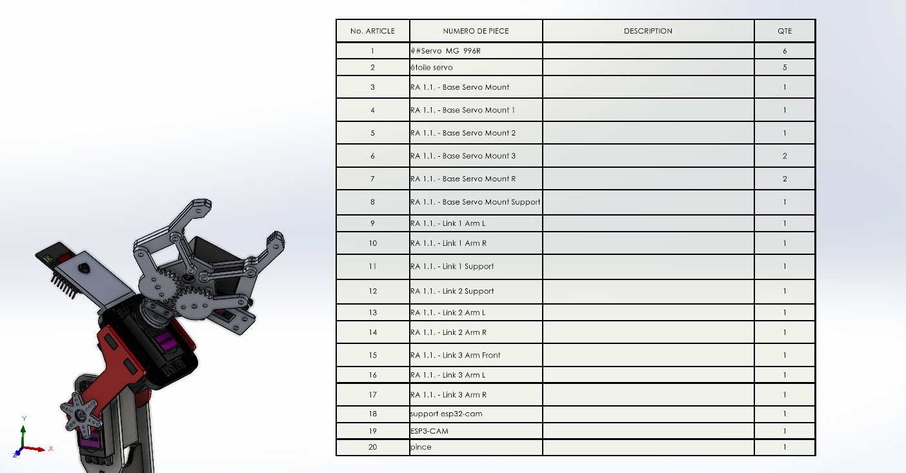
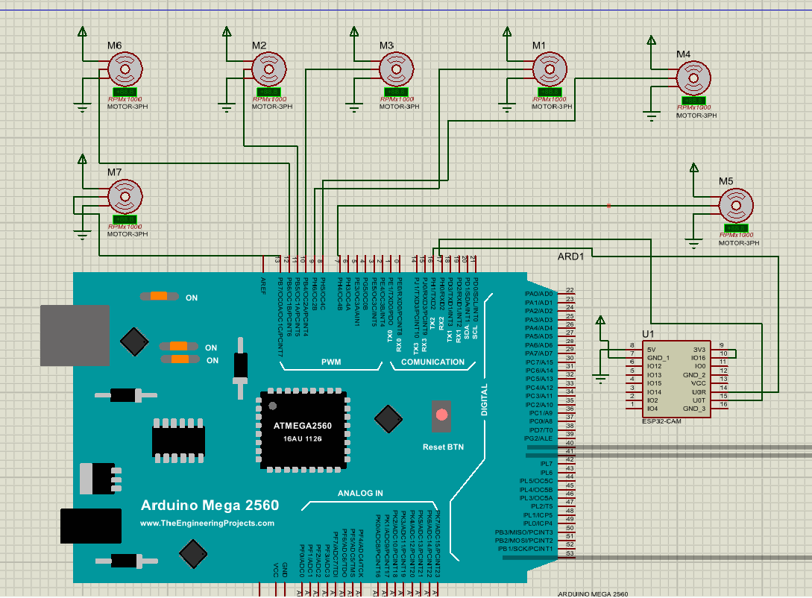
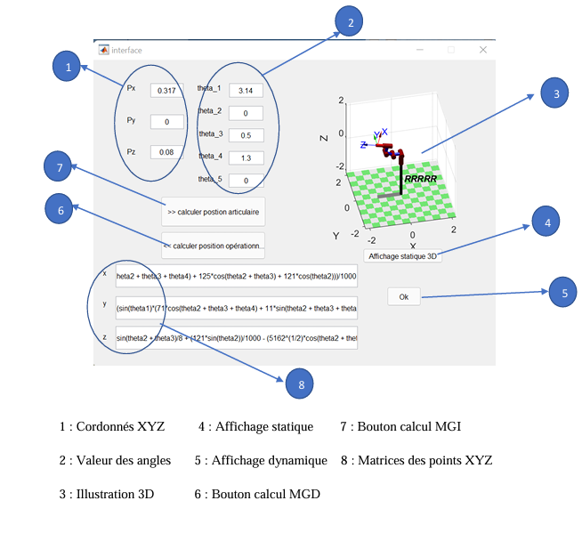
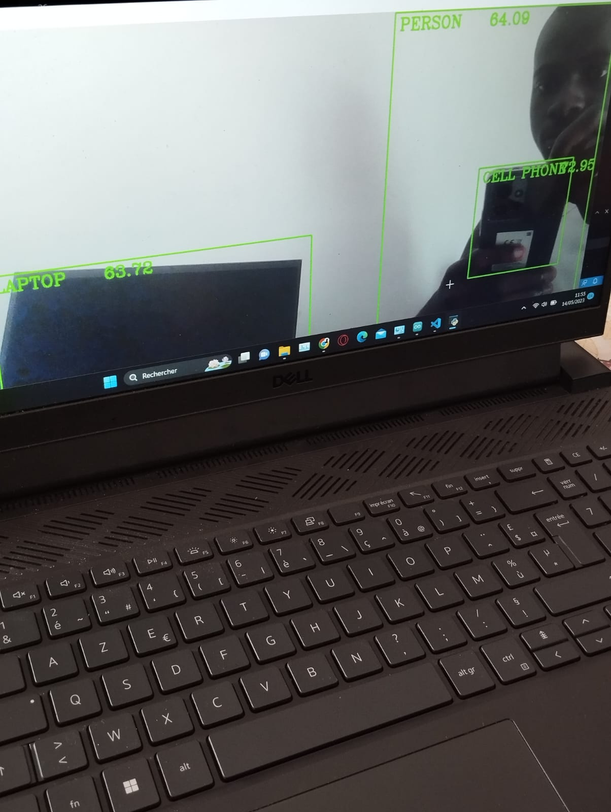
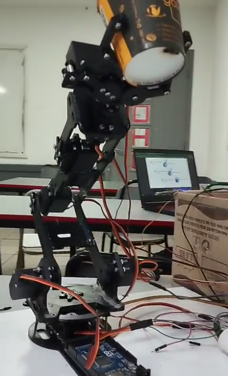
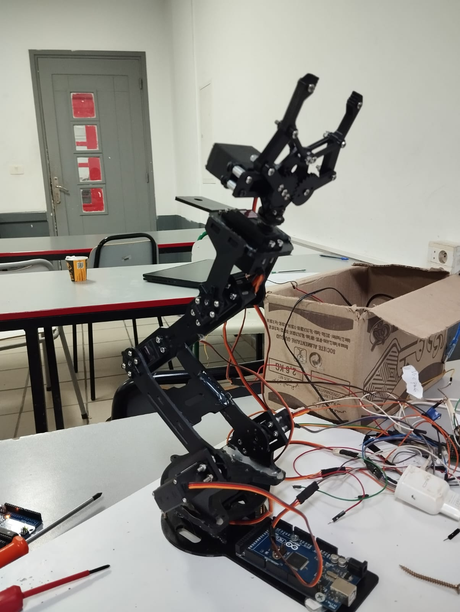

# Robot manipulateur 5 axes guidé par vision



Bras manipulateur robotisé à 5 degrés de liberté conçu pour détecter, atteindre et saisir des objets à l’aide d’une caméra, d’une pince motorisée et d’une chaîne de commande basée sur Arduino Mega.

Le projet réunit la conception mécanique sous SolidWorks, l’impression 3D de pièces en PLA, le dimensionnement des actionneurs, l’électronique de commande, la programmation embarquée, l’étude cinématique selon Denavit–Hartenberg, le pilotage via MATLAB et une base de vision par ordinateur développée en Python.

---

## Vue d’ensemble

| Élément | Description |
|---|---|
| Architecture robotique | Bras manipulateur série à 5 axes de type R-R-R-R-R |
| Fonction principale | Détection, positionnement et saisie d’objets |
| Structure mécanique | 3 segments principaux, 5 articulations et une pince motorisée |
| CAO | SolidWorks |
| Fabrication | Impression 3D en PLA |
| Contrôle bas niveau | Arduino Mega et Arduino IDE |
| Cinématique | Modèle Denavit–Hartenberg et trajectoires MATLAB |
| Vision | Caméra embarquée et développement de reconnaissance d’images en Python |
| Actionneurs | Servomoteurs MG995R-360°, MG996R, S07NF et servo de pince |
| Documentation | Rapport complet disponible dans le repository |

---

## Objectif du projet

L’objectif était de concevoir et de réaliser un manipulateur robotisé à cinq axes capable d’interagir avec son environnement.

Le système vise à :

- Détecter ou localiser un objet à partir d’une caméra.
- Calculer une configuration ou une trajectoire permettant au robot d’atteindre la zone ciblée.
- Commander les servomoteurs pour positionner les différents segments du bras.
- Actionner une pince afin de saisir l’objet.
- Valider les mouvements, les positions particulières et la cinématique développée sous MATLAB.

Le projet a été réalisé en première année du cycle ingénieur. Il a couvert l’étude, la conception, la fabrication, l’assemblage, la programmation et la modélisation MATLAB. La durée rapportée est d’environ deux semaines, soit 334 heures de travail cumulées.

---

## Architecture mécanique

Le robot est constitué de trois segments principaux et de cinq articulations rotatives en série.

```text
Base → Bras principal → Avant-bras → Poignet → Pince
```

### Actionneurs et dimensionnement

| Référence | Fonction | Couple calculé | Actionneur sélectionné |
|---|---|---:|---|
| `SM1` | Rotation de la base | 6,31 kg·cm | MG995R — rotation 360° |
| `SM2` | Bras principal | 6,31 kg·cm | MG996R |
| `SM3` | Avant-bras | 2,44 kg·cm | MG996R |
| `SM4` | Poignet | 0,22 kg·cm | S07NF |
| `SM5` | Ouverture / fermeture de la pince | — | Micro-servomoteur rotatif |

Les pièces ont été modélisées sous SolidWorks, puis exportées au format STL pour l’impression 3D. Les fichiers source SolidWorks et les modèles d’impression sont inclus dans le repository.

### Vue éclatée



### Effecteur et composants mécaniques



---

## Électronique et commande

La commande des actionneurs est assurée par une Arduino Mega. L’électronique permet de relier les sorties de commande aux différents servomoteurs du manipulateur et d’intégrer l’interface caméra utilisée pour la vision.



Les fichiers du projet électronique sont disponibles dans :

```text
electronics/
├── schematics/
└── wiring/
```

Le programme Arduino se trouve dans :

```text
firmware/arduino-mega/robot_manipulator_arduino_mega/
```

---

## Cinématique et logiciel

Le modèle cinématique du robot a été étudié à l’aide de la convention de Denavit–Hartenberg. Cette modélisation sert à décrire la position et l’orientation de l’effecteur en fonction des variables articulaires.

Les interfaces et scripts MATLAB sont disponibles dans :

```text
software/matlab-kinematics/
├── interface.m
├── interface.fig
├── ROBOTOP.m
└── ROBOTOP.fig
```



La partie vision a été développée en parallèle sous Python. Le dossier prévu pour ces développements est :

```text
software/python-vision/
```



---

## Fabrication et assemblage

Les éléments mécaniques ont été imprimés en PLA, assemblés autour des servomoteurs, puis connectés au système de commande.

Les fichiers STL destinés à l’impression 3D sont fournis dans :

```text
mechanical/stl-3d-printing/
```

Les fichiers SolidWorks de conception et d’assemblage sont disponibles dans :

```text
mechanical/robot-solidworks-source/
```

### Prototype assemblé






### Démonstration vidéo

La démonstration vidéo est disponible dans le repository :

[`robot_manipulator_demo.mp4`](assets/videos/robot_manipulator_demo.mp4)

> Selon le navigateur, GitHub peut proposer le téléchargement ou la lecture du fichier vidéo dans son interface.

---

## Résultats

Les principales validations obtenues durant le projet sont :

- Assemblage mécanique du bras manipulateur.
- Fabrication de composants par impression 3D.
- Commande des cinq axes par Arduino Mega.
- Tests de positions et de configurations particulières.
- Première exécution d’une cinématique générée dans MATLAB.
- Développement parallèle d’un modèle de reconnaissance d’images sous Python.
- Tests de détection par caméra documentés dans les médias du projet.

---

## Structure du repository

```text
.
├── archive/
│   ├── all-m3-sh-standard-screws-m3-hex-nut-and-flat-washer-for-m3-screw-1.snapshot.24.rar
│   └── steps.rar
│
├── assets/
│   ├── images/
│   │   ├── arduino_mega_wiring_diagram.png
│   │   ├── computer_vision_detection_test.jpg
│   │   ├── control_architecture_and_matlab_interface.png
│   │   ├── robot_3d_cad_assembly.png
│   │   ├── robot_end_effector_and_bom.png
│   │   ├── robot_exploded_view.png
│   │   ├── robot_prototype_testing_01.png
│   │   ├── robot_prototype_testing_02.png
│   │   └── robot_prototype_testing_03.jpg
│   └── videos/
│       └── robot_manipulator_demo.mp4
│
├── docs/
│   ├── calculations/
│   ├── denavit-hartenberg/
│   └── reports/
│       └── robot_manipulator_project_report.pdf
│
├── electronics/
│   ├── schematics/
│   └── wiring/
│
├── firmware/
│   └── arduino-mega/
│       └── robot_manipulator_arduino_mega/
│           └── robot_manipulator_arduino_mega.ino
│
├── mechanical/
│   ├── robot-solidworks-source/
│   └── stl-3d-printing/
│
├── software/
│   ├── matlab-kinematics/
│   └── python-vision/
│
└── README.md
```

---

## Fichiers importants

| Ressource | Emplacement |
|---|---|
| Rapport du projet | [`docs/reports/robot_manipulator_project_report.pdf`](docs/reports/robot_manipulator_project_report.pdf) |
| Code de commande Arduino | [`firmware/arduino-mega/robot_manipulator_arduino_mega/robot_manipulator_arduino_mega.ino`](firmware/arduino-mega/robot_manipulator_arduino_mega/robot_manipulator_arduino_mega.ino) |
| Scripts et interfaces MATLAB | [`software/matlab-kinematics/`](software/matlab-kinematics/) |
| Fichiers SolidWorks | [`mechanical/robot-solidworks-source/`](mechanical/robot-solidworks-source/) |
| Fichiers STL imprimables | [`mechanical/stl-3d-printing/`](mechanical/stl-3d-printing/) |
| Projet électronique | [`electronics/`](electronics/) |
| Vidéo de démonstration | [`assets/videos/robot_manipulator_demo.mp4`](assets/videos/robot_manipulator_demo.mp4) |

---

## Technologies utilisées

- SolidWorks.
- Impression 3D PLA.
- Arduino Mega.
- Arduino IDE.
- MATLAB.
- Convention de Denavit–Hartenberg.
- Programmation embarquée en C/C++ pour Arduino.
- Python pour les essais de vision par ordinateur.
- Servomoteurs MG995R, MG996R et S07NF.
- Git et GitHub pour la gestion et la documentation du projet.

---

## Améliorations possibles

- Ajouter le code Python complet de détection et de reconnaissance d’objets.
- Ajouter les paramètres Denavit–Hartenberg dans un tableau exploitable.
- Documenter les longueurs de segments, les plages angulaires et la charge utile.
- Ajouter les schémas électroniques exportés en PDF ou PNG.
- Ajouter une nomenclature complète des composants électroniques et mécaniques.
- Intégrer une cinématique inverse plus robuste avec gestion des limites articulaires.
- Ajouter une calibration caméra–robot pour transformer les coordonnées image en coordonnées du repère robot.
- Ajouter une alimentation dédiée aux servomoteurs et documenter les mesures de courant.
- Publier une vidéo courte de démonstration directement visible depuis le README.

---

## Auteur

**Joseph Mbode**  
Ingénieur en systèmes embarqués, électronique, mécatronique et conception de systèmes robotiques.

- GitHub : [@Josephulrich](https://github.com/Josephulrich)
- LinkedIn : [Joseph Mbode](https://www.linkedin.com/in/joseph-mbode)
